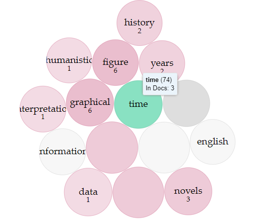

I will argue that within scholarly endeavors there should be a focus on elevating the discoverability of knowledge, and that movement toward new formats of data representation play a large role in that principle. Unfortunately sweeping hyperbolic statements aimed at discouraging the continued usage of a convention undermine their authors own goals. 

Of course disruptive new ways of looking at capta shouldn't be immediately dismissed either. Tactifully boosting the newer format is a worthwhile endeavor for those who have a vested interest. This could be done by exemplifying its virtues. Not by tearing down the established conventions, which risks losing out on additional perspectives. Especially considering the fact that there are many different intelligences and learning styles. Different data representation model trends could aide in establishing multiple understandings of the form being studied. Moreover the harsh stance could be taken as an insult by parties on the hesitant side of the change. Directly countering the intended outcome, which was meant to be an agreement from other scholars in the field. Although in certain situations these extreme measures are justified if the structure being railed against has damaging effects on the information’s validity. The truth is of the utmost importance and the understanding which is supposed to have been conveyed. 

“Whether or not digital humanities offer a radically new way of working with source materials, its focus on collegiality and community are important humanistic principles in a digital age that is often cast as primarily about performance and efficiency. ” 1 (Berry, 2017.)

I hope that through outlining my perspective, that the benefits of a cordial enlightenment become clear. Though those means we can bring more academics on board regarding dynamic digital models over static objects. Graphs are very useful designs that have also in some ways become a relic of the past, many graphs were developed and popularized by William Playfair between 1786 and 1801. 

“Playfair argued that the line graph had an advantage over figures in that it gave a simpler and more permanent idea of progress over time and was easier  and quicker to remember than figures alone.”
2 & 3 (Phaidon Archive)

Now given our technological advancements once again the data can be reframed. We must consider that change over time, could more successfully be related to an observer through an animated scale model. This is why I am definitely getting behind the idea of Digital Humanities moving forward with this new form. I just want to push back on the dictatorial tone of the original text discussing this potential change.

With that said, let’s move into the content of the argument. To briefly summarize, it has been stated that displays should now use animations instead of static graphs to represent the passage of time. Given the nature of temporality I would agree that animations are a better tool for this purpose. Especially now in our modern internet era, it is clear that screens capable of playing back these graphs become more and more accessible. So risk that these gif or video formats would hold back your capta from mass consumption has been mitigated. Additionally these new animated “graphs” better depict the change within a system from one moment to the next. By using a format that shares more aspects with the phenomena being modeled, we have to make the assumption that it reveals information closer to the truth. This narrows the conceptual gap between the form studied and output model.

While I expect those assumptions to hold true. If we were to move forward using animations in this way. There are a few pressing questions regarding how to model the capta. Time and temporality can appear to be shown in different ways. Would the rate of change always be represented best over a linear rate of frames? Or alternatively could a sequence of snapshots for each key moment serve to generate a more interesting animation. In this case any instance of observed change would be given a frame, despite its duration during the original observation. That style of representation magnifies the shorter phases, and minimizes the longer phases. This could reveal some valuable information as well, but conversely distorts the time more toward just it’s temporal states. Perhaps each could exist to be chosen on case by case basis. To further a caption or image itself could describes a sort of temporal scale.

Digital Humanities and other fields of scholarly study should open up to the radical progression of data models. As knowledge and the capabilities of human understanding themselves evolve much in the same way as any other subject of study, all objects in our universe even.

 “ for [Henri] Bergson, duration has an even more radical role in the universe: it is an agent of invention and novelty: “duration means invention, the creation of forms, the continual elaboration of the absolutely new” [2014: 277]. This aspect of duration is, in Bergson’s view, supported by the verifiable fact that living species evolve through time. Bergson thinks of the evolution of life as an intrinsically creative process, one that is constantly bringing about novelty and is thus unforeseeable. “
4 (Marchesini, 2018)

 Most fitting given the temporality being discussed. Just like the evolution of life, the evolution of our processes processed through time. By making a change here in the present about how to better model forms with an axis of time. We could open up new avenues of understanding and knowledge. It may even happen to enhance our ability to define temporal forms, like those unstable timeframes discussed in this passage from Moretti’s work regarding graphs. 

“Event, cycle, longue durée: three time frames which have fared very
unevenly in literary studies. Most critics are perfectly at ease with the
first one, the circumscribed domain of the event and of the individual
case; most theorists are at home at the opposite end of the temporal
spectrum, in the very long span of nearly unchanging structures. But
the middle level has remained somewhat unexplored by literary historians; and it’s not even that we don’t work within that time frame, it’s
that we haven’t yet fully understood its specificity: the fact, I mean, that
cycles constitute temporary structures within the historical flow. That is
after all the hidden logic behind Braudel’s tripartition: the short span is
all flow and no structure, the longue durée all structure and no flow, and
cycles are the—unstable—border country between them. Structures,
because they introduce repetition in history, and hence regularity, order,
pattern; and temporary, because they’re short (ten, twenty, fifty years,
this depends on the theory).
” 5 (Moretti 2003)

To reiterate if these animated models can enhance representational accuracy they will contribute to discoverability. Across many fields of study there will be changes, much room to reinterpret past capta in new ways. Digital Humanities Scholars should be very motivated to ensure new technologies become integrated into academia. Specifically with something as fundamental as the influence of time on a system. These new model formats will need tools for Scholars from other fields to generate their own. This should be part of our effort as Digital Humanists to promote the proposed change.

TermsBerry generated using Voyant
Time is discussed heavily within DH articles and books.

REFERENCES

1. Berry, David M., and Anders Fagerjord. Digital Humanities : Knowledge and Critique in a Digital Age, Polity Press, 2017.

2. The Phaidon Archive of Graphic Design. ID: B003 Pie Chart

3. The Phaidon Archive of Graphic Design. ID: A018 The Commercial and Political Atlas

4. Paula Marchesini. The End of Time or Time Reborn? Henri Bergson and the Metaphysics of Time in Contemporary Cosmology, ,  2018.

5. Franco Moretti. New Left Review: Graphs Maps, Trees, 2003

