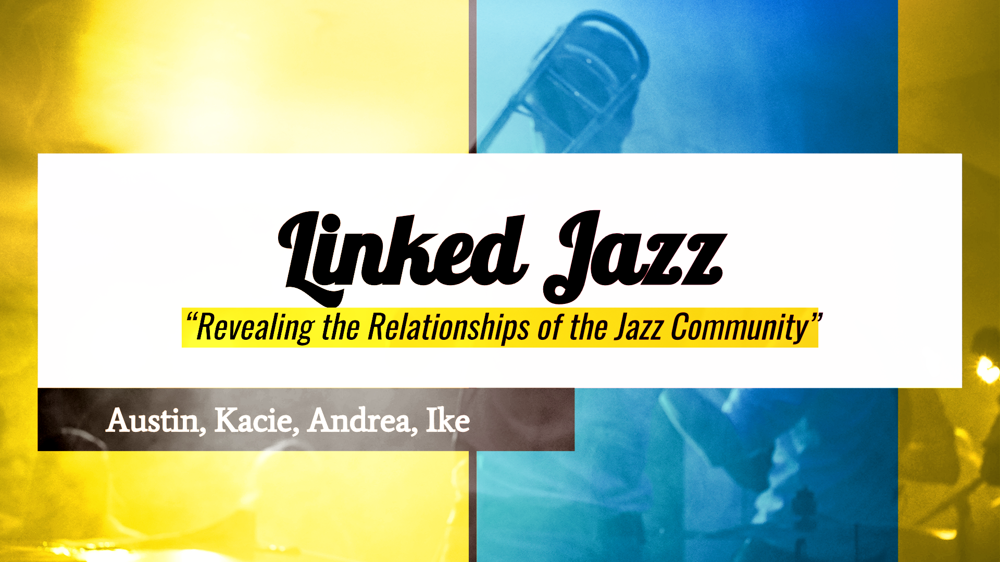

## Mervyn Hunt
Bio:

I am a designer, artist, and student of Digital Humanities, Studying at Brock University and going into my third year with a major in Interactive Arts and Science (IASC). My focus and passion is within the digital expression concentration. My art and design portfolio shows competency within that area. To continue advancement of my skills, I am looking toward research regarding technical art and graphic/experience design. For example, the academic blog that I have written in response to proposed new methods of graphing temporal data. For the future I would like to take a further academically minded look into the ways which technology has expanded human expression, and where might it be headed. I want to research the many questions I could ask about the democratization of media creation tools and knowledge, technology in conjunction with open platforms. The projects presented as part of this portfolio are representative of a specialization in data visualization.

## Featured Project

## Research Presentation
.jpg)
Abstract: This presnation takes the Memex device concept and supposes it had become a reality. We begin by providing some background into technologies which might have been implmented for this tehnology. What would the world with a proto-internet system have been like, 20 years a head of common electronic computers.

to revise this presentation I would have changed my research and stucture. Dismiss so much of the backgroun informationa nd focus more heavly on what the imagined impacts of this technology would ahve been. As well I would have more of the details clearly explained. Like who the creator was and what were their ideas meant to represent. Explaining the technical side of things is fine but I need more division between the humanities part and the practical technology.

[Memex](reveal/index.html)

## Collaborative Presentation
For our group presentation, we collborated on research into use of linked open data. Specifically a project by the name of Linked Jazz. It is a collbortative project of its own right. Created and developed between multiple insitusions and funded by research grants. It takes advantage of a database constructed from archival data of the historical Jazz music scene. The world of Jazz music can be visualized as a  By linking, searching and marking up old interviews, Album and concert details, etc. Artist's networks of collbarorators, infulences, freinds and other interesting facts can be rediscovered or possibly found for the first time.  

Deliverables: 

Research of the general background information, and some examples which tied into the theoretical components of our presentation.

Creation of graphic design to make the presentation more attractive. 

The constructed slideshow itself, enteringmost of the written research into point form lists: https://docs.google.com/presentation/d/1vd3dYX-A2UtBQR-U2PApYLCKavPSctZPEv3WvfFr8wU/edit?usp=sharing

## Academic Blog
I will argue that within scholarly endeavors there should be a focus on elevating the discoverability of knowledge, and that movement toward new formats of data representation play a large role in that principle. Unfortunately sweeping hyperbolic statements aimed at discouraging the continued usage of a convention undermine their authors own goals...
[Continue Reading](blog)

